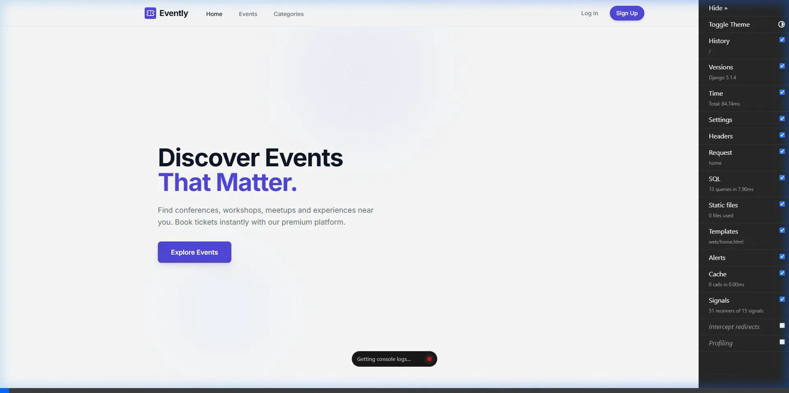
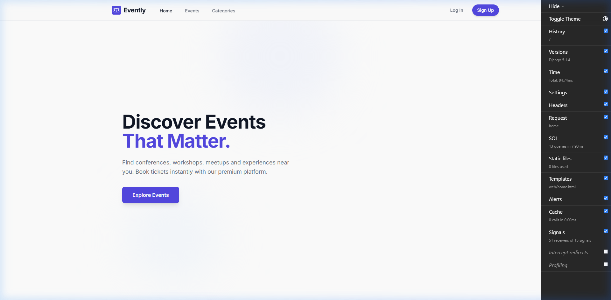
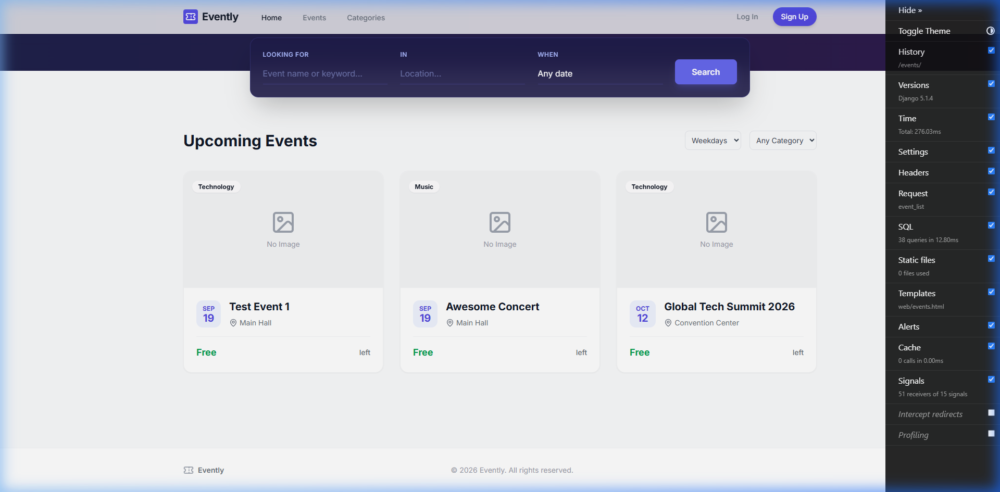
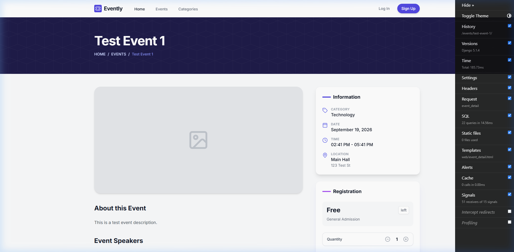
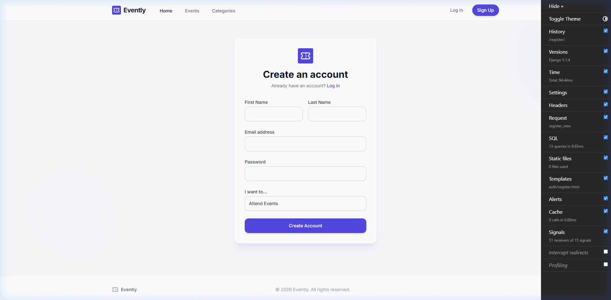
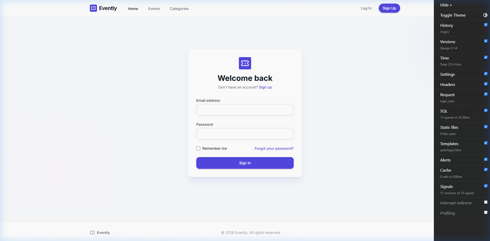

# Evently - Smart Event Management System


Evently is a comprehensive, production-ready Event Management System built with Django and Django REST Framework. It provides a robust backend for managing events, ticketing, orders, check-ins, notifications, and more, complete with both web templates and a RESTful API.

## 🚀 Features

- **User Authentication**: Secure JWT authentication and custom user models.
- **Event Management**: Create, update, and manage events, categories, and schedules.
- **Ticketing & Orders**: Manage ticket tiers, capacities, and process secure orders.
- **Payment Integration**: Support for Stripe, SSLCommerz, bKash, and Nagad.
- **Coupons & Discounts**: Apply promotional codes and discounts dynamically.
- **Attendees & Check-ins**: Track attendees and perform seamless event check-ins.
- **Notifications**: Email and push notifications powered by Celery.
- **Reviews & Ratings**: Allow attendees to review events post-attendance.
- **Reports**: Generate analytics and event performance reports.
- **API Documentation**: Auto-generated Swagger/OpenAPI specifications.

## 📸 Application Screenshots & Walkthrough

Here is a step-by-step visual walkthrough of the application:

### 1. Live Demo Recording
Watch the full interaction flow from the live test:


### 2. Homepage
The main landing page featuring upcoming events and calls to action.


### 3. Events Directory
Browsing through the available events with filtering options.


### 4. Event Detail View
Viewing the details, date, and ticketing information for a specific event.


### 5. User Registration
The sign-up page for new attendees to create an account.


### 6. User Login
Secure authentication page for existing users.


## 🛠 Tech Stack

- **Backend Core:** Django, Django REST Framework
- **Database:** PostgreSQL (Production), SQLite (Local fallback)
- **Caching & Broker:** Redis
- **Task Queue:** Celery, Celery Beat
- **Containerization:** Docker, Docker Compose
- **API Specs:** drf-spectacular (OpenAPI 3)

## 📋 Prerequisites

To run this project, you will need:
- Python 3.10+ (if running locally without Docker)
- Docker & Docker Compose (Recommended)
- PostgreSQL (if running locally without Docker)
- Redis (if running locally without Docker)

---

## 💻 Local Development Setup (Using Docker - Recommended)

The easiest way to get started is by using Docker Compose, which spins up the Django web server, PostgreSQL, Redis, Celery workers, and Celery beat automatically.

1. **Clone the repository**
2. **Setup Environment Variables:**
   ```bash
   cp .env.example .env
   ```
   *(Update the `.env` file with any specific credentials if needed, default values will work out of the box for local dev).*
3. **Build and start the containers:**
   ```bash
   docker-compose up -d --build
   ```
4. **Apply database migrations:**
   ```bash
   docker-compose exec web python manage.py migrate
   ```
5. **Create a superuser:**
   ```bash
   docker-compose exec web python manage.py createsuperuser
   ```

The application will be accessible at: `http://localhost:8000`

---

## 🐍 Local Development Setup (Without Docker)

If you prefer to run the project natively using a virtual environment:

1. **Setup Virtual Environment:**
   ```bash
   python -m venv .venv
   source .venv/bin/activate  # On Windows: .venv\Scripts\activate
   ```

2. **Install Dependencies:**
   ```bash
   cd backend
   pip install -r requirements/development.txt
   ```

3. **Environment Setup:**
   ```bash
   cp ../.env.example ../.env
   ```
   *(Ensure `DATABASE_URL` is commented out or properly configured to use SQLite by default).*

4. **Run Migrations:**
   ```bash
   python manage.py migrate
   ```

5. **Start the Development Server:**
   ```bash
   python manage.py runserver
   ```
   The application will be accessible at: `http://localhost:8000`

6. **Start Celery (Optional for background tasks):**
   ```bash
   # Make sure Redis is running locally on port 6379
   celery -A config.celery worker -l info
   ```

---

## 📚 API Documentation

The API endpoints are fully documented using OpenAPI/Swagger.

Once the server is running, you can access the documentation at:
- **Swagger UI:** `http://localhost:8000/api/docs/`
- **ReDoc:** `http://localhost:8000/api/redoc/`
- **Schema:** `http://localhost:8000/api/schema/`

## 🧪 Testing

To run the test suite, ensure your virtual environment is activated and run:
```bash
cd backend
pytest
```
For test coverage:
```bash
pytest --cov=apps
```

## 📂 Project Structure

```
eventmanagement/
├── backend/
│   ├── apps/               # Django functional apps (accounts, events, etc.)
│   ├── config/             # Core project settings and URL routing
│   ├── requirements/       # Project dependencies (base, dev, prod)
│   ├── templates/          # Global HTML templates
│   └── manage.py
├── nginx/                  # Nginx configuration for production
├── .env.example            # Example environment variables
├── docker-compose.yml      # Docker compose configuration for development
└── docker-compose.prod.yml # Docker compose configuration for production
```
